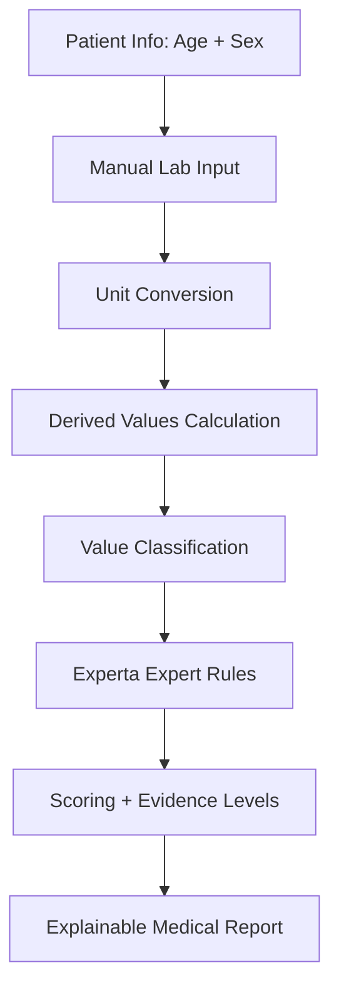

<div align="center">

# 🩺 Medical Expert System Using Experta

### A dark-themed, explainable, rule-based medical lab interpretation system  
#### Built with Python, Experta, Streamlit, and JSON Knowledge Bases

<br/>


<br/>

> **Educational medical expert system for interpreting CBC and glucose-related lab values using explainable rules.**

</div>

---

## ⚠️ Medical Disclaimer

This project is for **educational and decision-support purposes only**.  
It does **not** provide a final medical diagnosis and does **not** replace a qualified healthcare professional.

Medical interpretation depends on many factors, including symptoms, examination, medical history, medications, pregnancy status, laboratory reference ranges, and follow-up testing.

---

## 📌 Project Overview

The goal of this project is to build a medical expert system that can help users understand common lab test results.

The system currently supports **manual input** of lab values and is designed to later support **OCR input** from lab report images.

### General Workflow



---

## ✨ Key Features

| Feature | Description |
|---|---|
| 🧠 **Experta Expert System** | Uses facts and rules through Experta for medical reasoning |
| 🧬 **CBC Interpretation** | Supports hemoglobin, WBC, platelets, RBC indices, differential counts, and more |
| 🍬 **Glucose Interpretation** | Supports fasting glucose, random glucose, OGTT, HbA1c, fructosamine, insulin, and C-peptide |
| 👤 **Age + Sex Context** | Classifies values differently depending on patient age group and sex |
| 🔁 **Unit Conversion** | Converts multiple lab units into standard internal units |
| 🧮 **Derived Values** | Calculates ANC, ALC, AEC, absolute monocytes, and absolute basophils |
| 🚨 **Urgent Patterns** | Detects potentially urgent lab patterns through expert rules |
| 🧾 **Explainable Report** | Shows matched rules, reasoning, scores, follow-up tests, and advice |
| 🌙 **Dark Medical UI** | Streamlit interface with dark theme, cards, badges, and simple animations |
| 🔍 **OCR-Ready Structure** | Input format is ready for future OCR extraction |

---

## 🖥️ UI Preview

> Add screenshots here after uploading the project to GitHub.

```text
screenshots/
├── dashboard.png
├── input-form.png
├── unit-conversion-summary.png
└── report-output.png
```

Example Markdown for screenshots:

```md

```

---

## 🧠 Expert System Design

The main reasoning layer is based on **Experta**.

### Example Facts

```python
LabStatus(test="hemoglobin", status="low")
LabStatus(test="mcv", status="low")
LabValue(test="wbc", value=15500)
PatientInfo(sex="female", age=25, age_group="adult")
```

### Example Expert Rule

```python
@Rule(
    LabStatus(test="hemoglobin", status="low"),
    LabStatus(test="mcv", status="low")
)
def microcytic_anemia_pattern(self):
    self.add_rule_result(
        rule_id="EX_R002",
        condition_id="microcytic_anemia_pattern",
        weight=6,
        explanation="Low hemoglobin together with low MCV supports a microcytic anemia pattern."
    )
```

This makes the system a real **rule-based expert system**, where medical conclusions are produced by facts and rules rather than only normal Python `if` statements.

---

## 🧪 Supported Lab Tests

### CBC Panel

| Test | Internal ID |
|---|---|
| Hemoglobin | `hemoglobin` |
| Hematocrit | `hematocrit` |
| Red Blood Cells | `rbc` |
| White Blood Cells | `wbc` |
| Platelets | `platelets` |

### RBC Indices

| Test | Internal ID |
|---|---|
| Mean Corpuscular Volume | `mcv` |
| Mean Corpuscular Hemoglobin | `mch` |
| Mean Corpuscular Hemoglobin Concentration | `mchc` |
| Red Cell Distribution Width | `rdw` |

### WBC Differential

| Test | Internal ID |
|---|---|
| Neutrophils % | `neutrophils_percent` |
| Lymphocytes % | `lymphocytes_percent` |
| Monocytes % | `monocytes_percent` |
| Eosinophils % | `eosinophils_percent` |
| Basophils % | `basophils_percent` |

### Derived WBC Values

| Derived Value | Formula |
|---|---|
| ANC | `WBC × Neutrophils% / 100` |
| ALC | `WBC × Lymphocytes% / 100` |
| AEC | `WBC × Eosinophils% / 100` |
| Absolute Monocytes | `WBC × Monocytes% / 100` |
| Absolute Basophils | `WBC × Basophils% / 100` |

### Glucose-Related Tests

| Test | Internal ID |
|---|---|
| Fasting Glucose | `fasting_glucose` |
| Random Glucose | `random_glucose` |
| Postprandial Glucose | `postprandial_glucose` |
| OGTT 2-Hour Glucose | `ogtt_2h_glucose` |
| HbA1c | `hba1c` |
| Estimated Average Glucose | `estimated_average_glucose` |
| Fructosamine | `fructosamine` |
| Fasting Insulin | `fasting_insulin` |
| C-Peptide | `c_peptide` |

---

## 👤 Age and Sex Support

The system uses patient context:

```python
{
    "sex": "female",
    "age": 25,
    "age_group": "adult"
}
```

Supported age groups:

| Age Group | Rule |
|---|---|
| `newborn` | age < 1 |
| `child` | 1 ≤ age < 13 |
| `adolescent` | 13 ≤ age < 18 |
| `adult` | age ≥ 18 |

### Why this matters

The same value may be interpreted differently depending on age.

```text
WBC = 13000 cells/mcL

Adult  -> high
Child  -> normal
```

---

## 🔁 Unit Conversion System

The project supports unit conversion through:

```text
knowledge_base/units.json
core/unit_converter.py
```

### Examples

| Input | Normalized |
|---|---|
| `WBC = 9.8 10^9/L` | `9800 cells/mcL` |
| `Platelets = 390 10^9/L` | `390000 cells/mcL` |
| `Glucose = 7.9 mmol/L` | `142.2 mg/dL` |
| `Hemoglobin = 101 g/L` | `10.1 g/dL` |
| `HbA1c = 55 mmol/mol` | `≈ 7.18 %` |

### Supported Input Styles

#### Simple style

```python
patient_values = {
    "hemoglobin": 10.1,
    "wbc": 9800
}
```

#### Unit-aware style

```python
patient_values = {
    "hemoglobin": {
        "value": 101,
        "unit": "g/L"
    },
    "wbc": {
        "value": 9.8,
        "unit": "10^9/L"
    }
}
```

---

## 🚨 Urgent Pattern Detection

Urgent warning patterns are also handled by Experta rules.

Examples include:

- Very low hemoglobin
- Very low WBC
- Very low ANC
- Very low platelets
- Very low glucose
- Very high glucose
- Very high HbA1c
- Very high fructosamine

Example:

```text
Platelets = 38 × 10^9/L
Normalized = 38000 cells/mcL
Result = urgent medical attention pattern
```

---

## 🧾 Report Output

The generated report includes:

- Summary
- Patient context
- Raw input values
- Normalized values
- Derived values
- Classified statuses
- Urgent patterns
- Possible conditions
- Evidence scores
- Matched rule IDs
- Explanation for each matched rule
- Suggested follow-up tests
- General advice
- Safety notes
- Disclaimer

---

## 📁 Project Structure

```text
medical_expert_system/
│
├── app.py
├── main.py
├── validate_kb.py
├── test_examples.py
├── requirements.txt
├── README.md
│
├── core/
│   ├── __init__.py
│   ├── analyzer.py
│   ├── classifier.py
│   ├── derived_values.py
│   ├── experta_engine.py
│   ├── json_rule_engine.py
│   ├── loader.py
│   ├── patient_context.py
│   ├── report_builder.py
│   ├── scorer.py
│   ├── unit_converter.py
│   └── validator.py
│
├── knowledge_base/
│   ├── tests.json
│   ├── conditions.json
│   ├── rules.json
│   ├── red_flags.json
│   ├── severity_levels.json
│   └── units.json
│
└── examples/
    └── sample_patients.json
```

---

## 🧩 File Responsibilities

| File | Responsibility |
|---|---|
| `app.py` | Streamlit dark medical UI |
| `main.py` | Terminal testing entry point |
| `core/analyzer.py` | Main analysis pipeline |
| `core/experta_engine.py` | Main Experta rule engine |
| `core/classifier.py` | Classifies values into statuses |
| `core/unit_converter.py` | Converts input units |
| `core/derived_values.py` | Calculates ANC, ALC, AEC, etc. |
| `core/report_builder.py` | Builds final structured report |
| `core/scorer.py` | Calculates condition scores |
| `core/validator.py` | Validates knowledge base files |
| `knowledge_base/tests.json` | Lab tests and reference ranges |
| `knowledge_base/conditions.json` | Condition descriptions and advice |
| `knowledge_base/units.json` | Unit conversion rules |
| `knowledge_base/severity_levels.json` | Score interpretation levels |

---

## ⚙️ Installation

### 1. Clone the repository

```bash
git clone https://github.com/your-username/medical-expert-system.git
cd medical-expert-system
```

### 2. Create a virtual environment

#### Windows

```bash
python -m venv venv
venv\Scripts\activate
```

#### Linux / macOS

```bash
python3 -m venv venv
source venv/bin/activate
```

### 3. Install requirements

```bash
pip install -r requirements.txt
```

---

## 📦 Requirements

Example `requirements.txt`:

```text
experta==1.9.4
frozendict==1.2
streamlit
```

> Streamlit may automatically install packages such as `pandas`, `numpy`, `altair`, and `pyarrow`. This is normal.

---

## ▶️ Running the Project

### Run the Streamlit UI

```bash
streamlit run app.py
```

### Run terminal test

```bash
python main.py
```

### Validate the knowledge base

```bash
python validate_kb.py
```

Expected output:

```text
Knowledge base validation passed.
```

---

## 🧪 Example Input

```python
from core.analyzer import analyze_patient

patient_values = {
    "hemoglobin": {
        "value": 101,
        "unit": "g/L"
    },
    "wbc": {
        "value": 9.8,
        "unit": "10^9/L"
    },
    "platelets": {
        "value": 390,
        "unit": "10^9/L"
    },
    "mcv": {
        "value": 70,
        "unit": "fL"
    },
    "mch": {
        "value": 22,
        "unit": "pg"
    },
    "fasting_glucose": {
        "value": 7.9,
        "unit": "mmol/L"
    },
    "hba1c": {
        "value": 55,
        "unit": "mmol/mol"
    }
}

report = analyze_patient(
    patient_values=patient_values,
    sex="female",
    age=25
)
```

---

## 📤 Example Output

```text
Patient context:
- Sex: female
- Age: 25
- Age group: adult

Normalized values:
- hemoglobin: 10.1 g/dL
- wbc: 9800 cells/mcL
- platelets: 390000 cells/mcL
- fasting_glucose: 142.2 mg/dL
- hba1c: 7.18 %

Possible patterns:
- Possible anemia pattern
- Possible microcytic anemia pattern
- Possible diabetes pattern
```

---

## ✅ Suggested Test Cases

| # | Case | Expected Patterns |
|---|---|---|
| 1 | Normal adult | No major pattern |
| 2 | Microcytic anemia | Anemia + microcytic anemia |
| 3 | Macrocytic anemia | Anemia + macrocytic anemia |
| 4 | Normocytic anemia | Anemia + normocytic anemia |
| 5 | Infection with neutrophilia | Infection/inflammation + neutrophilia |
| 6 | Thrombocytopenia urgent case | Thrombocytopenia + urgent pattern |
| 7 | Combined cytopenia | Combined cytopenia |
| 8 | Prediabetes | Prediabetes pattern |
| 9 | Diabetes with mixed units | Diabetes pattern |
| 10 | Very high HbA1c | Poor long-term glucose control |
| 11 | Discordant glucose | Discordant glucose results |
| 12 | Hypoglycemia urgent case | Hypoglycemia + urgent pattern |
| 13 | Age effect test | Different output for child vs adult |
| 14 | Newborn range test | Newborn-specific interpretation |

---

## 🧠 Knowledge Base Validation

Before running the system, validate the knowledge base:

```bash
python validate_kb.py
```

The validator checks:

- Missing required rule fields
- Unknown tests in rules
- Unknown condition IDs
- Duplicate rule IDs
- Invalid red flag operators
- Invalid unit definitions
- Unsupported conversion formulas
- Missing default units
- Invalid scoring configuration

---

## 🔎 Important Unit Notes

Some lab reports write WBC and platelets in compact units:

```text
WBC = 9.8 × 10^9/L
Platelets = 390 × 10^9/L
```

In the UI, enter them as:

```text
WBC value: 9.8
WBC unit: 10^9/L

Platelets value: 390
Platelets unit: 10^9/L
```

Do **not** enter:

```text
WBC = 9.8 cells/mcL
```

because that means the value is literally 9.8 cells/mcL, which is extremely low and may incorrectly trigger an urgent pattern.

---

## 📷 OCR Readiness

OCR is not active in the current version.

However, the system is ready for OCR because it accepts structured values with units:

```python
{
    "wbc": {
        "value": 9.8,
        "unit": "10^9/L"
    },
    "hemoglobin": {
        "value": 101,
        "unit": "g/L"
    }
}
```

The future OCR layer should extract:

- Test name or alias
- Numeric value
- Unit
- Optional reference range

Then it should map the extracted test name to the internal test ID using aliases in `tests.json`.

---

## 🛣️ Future Improvements

- OCR image input
- Automatic test-name mapping from lab reports
- User confirmation screen after OCR extraction
- Export report as PDF
- Patient history and previous-result comparison
- MCQ generation for medical students
- More panels:
  - Kidney function
  - Liver function
  - Lipid profile
  - Thyroid profile
  - Electrolytes
- More advanced pediatric ranges
- Visual rule editor
- Admin dashboard for editing the knowledge base

---

## 🧾 License

This project is currently for educational use.  
You may add an open-source license such as MIT if you plan to publish it publicly.

---

## 👨‍💻 Author

Developed as an educational expert system project using:

- Python
- Experta
- Streamlit
- JSON-based knowledge bases

<div align="center">

### ⭐ If this project helps you, consider starring the repository.

</div>
